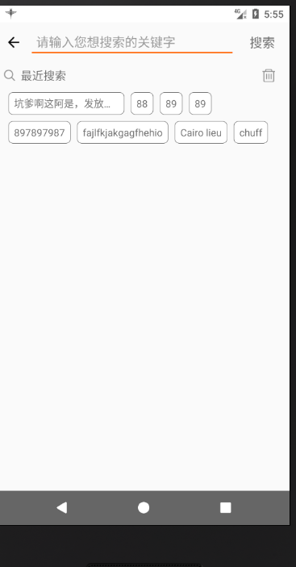

### 效果:



### 使用方法：

```xml
      <com.genius.fluidlayout.FluidLayout
            android:id="@+id/flowlayout"
            android:layout_width="match_parent"
            android:layout_height="wrap_content"
            android:paddingLeft="10dp"
            android:paddingRight="10dp"
            app:maxlinecount="2"
            >
        </com.genius.fluidlayout.FluidLayout>

```
> `app:maxlinecount="2"`是设置最大行数为2，若不设置或设置0则为自适应

```java
        final TextView textView = new TextView(mContext);
        FluidLayout.LayoutParams params = new FluidLayout.LayoutParams(
                ViewGroup.LayoutParams.WRAP_CONTENT,
                ViewGroup.LayoutParams.WRAP_CONTENT
        );
        params.setMargins(12, 12, 12, 12);
        textView.setEllipsize(TextUtils.TruncateAt.END);
        //设置最大字数为10，多余的显示...
        textView.setMaxEms(10);
        textView.setSingleLine(true);
        textView.setPadding(8,8,8,8);
        textView.setBackgroundResource(R.drawable.btn_shape_white_grey);
        textView.setText("text");
        flowlayout.addView(textView, params);

```

###### drawable下的btn_shape_white_grey代码：

```xml
<?xml version="1.0" encoding="utf-8"?>
<selector xmlns:android="http://schemas.android.com/apk/res/android">

    <item android:state_pressed="false">
        <shape
            android:shape="rectangle">
            <!--四个角的圆角半径，左边右边中间的区别就是在这里体现的-->
            <corners
                android:radius="6dp"
                />

            <!--指定边框，边框必须要的-->
            <stroke
                android:width="0.75dp"
                android:color="#777"/>
            <!--填充颜色，选中和未选中的区别就在这里还有文字颜色-->
            <solid
                android:color="@color/white"/>

        </shape>
    </item>

    <!--<item android:state_pressed="true">-->
        <!--<shape-->
            <!--android:shape="rectangle">-->
            <!--&lt;!&ndash;四个角的圆角半径，左边右边中间的区别就是在这里体现的&ndash;&gt;-->
            <!--<corners-->
                <!--android:radius="6dp"-->
                <!--/>-->

            <!--&lt;!&ndash;指定边框，边框必须要的&ndash;&gt;-->
            <!--<stroke-->
                <!--android:width="0.75dp"-->
                <!--android:color="@color/main_blue"/>-->
            <!--&lt;!&ndash;填充颜色，选中和未选中的区别就在这里还有文字颜色&ndash;&gt;-->
            <!--<solid-->
                <!--android:color="@color/main_blue"/>-->

        <!--</shape>-->
    <!--</item>-->
</selector>

```
